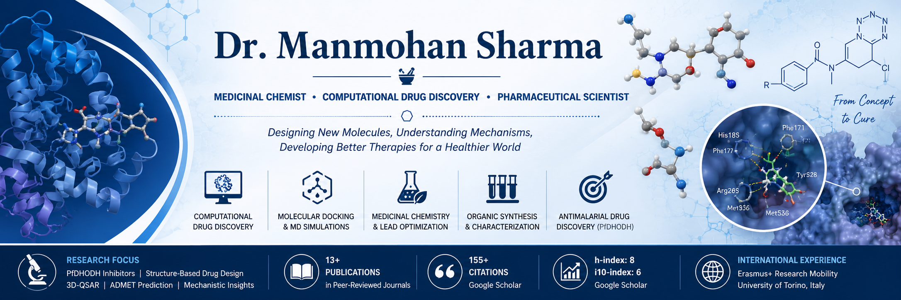

  

  

# 
👋 Dr. Manmohan Sharma

<b>Medicinal Chemist • Computational Drug Discovery • Pharmaceutical Scientist</b>

## 📂 Quick Navigation

- 👤 [About Me](About-Me/)
- 📄 [Curriculum Vitae (CV)](CV/)
- 📚 [Publications](Publications/)
- 🧪 [Research Projects](Projects/)
- 💻 [Technical Skills](Skills/)
- 🎤 [Conferences & Workshops](Conferences/)
- 🏆 [Achievements](Achievements/)
- 📬 [Contact](Contact/)

📍 India • 💊 Medicinal Chemistry • 🧬 Drug Discovery

---

# Welcome

Welcome to my professional research portfolio.

I completed my **Ph.D. in Pharmaceutical Sciences (Medicinal Chemistry)** from the **Institute of Pharmacy, Nirma University, Ahmedabad, India**.

My research combines **medicinal chemistry**, **computational drug discovery**, **structure-based drug design**, **molecular modeling**, and **organic synthesis** to develop novel therapeutic agents for infectious diseases, particularly antimalarial drug discovery.

## 📊 Research Highlights

- 🎓 Completed Ph.D. in Pharmaceutical Sciences (Medicinal Chemistry), Institute of Pharmacy, Nirma University, Ahmedabad, India.
- 📚 Author/Co-author of **13 peer-reviewed research publications** in international journals.
- 📈 **155+ Google Scholar citations**, **h-index: 8**, **i10-index: 6**.
- 🌍 International research experience through the **Erasmus+ Programme** at the University of Torino, Italy.
- 🏆 Recipient of the **SCI2024 Fellowship** awarded by the Italian Chemical Society.
- 🥇 Best Researcher of the Year (2023), Institute of Pharmacy, Nirma University.
- 🥇 Young Scientist Award (2023), ICLTIPB-2023.
- 🥇 First Prize in Poster Presentation, ISCB International Conference 2024.

---

# 👨‍🔬 About Me

- 🎓 Ph.D. in Pharmaceutical Sciences (Medicinal Chemistry)
- 🧪 Research experience in Medicinal Chemistry & Drug Discovery
- 💻 Experienced in Computational Chemistry
- 🧬 Organic Synthesis & Biological Evaluation
- 🌍 Erasmus+ Research Fellow at the University of Torino, Italy
- 📖 Author of multiple peer-reviewed publications

---

## 🔬 Research Interests

- Medicinal Chemistry
- Antimalarial Drug Discovery
- PfDHODH Inhibitors
- Structure-Based Drug Design
- Molecular Docking
- Molecular Dynamics Simulation
- Organic Synthesis
- Lead Optimization

---

# 📊 Research Profile

# 📂 Portfolio

Explore the sections below to learn more about my academic and research journey.

| 📁 Section | Description |
|------------|-------------|
| 👤 About-Me | Professional profile and research interests |
| 📄 CV | Curriculum Vitae |
| 📚 Publications | Peer-reviewed journal articles |
| 🧪 Projects | Research projects from B.Pharm to Ph.D. |
| 💻 Skills | Technical and laboratory skills |
| 🎤 Conferences | Scientific conferences, workshops, and training |
| 🏆 Achievements | Awards, fellowships, and recognitions |
| 📬 Contact | Contact details and professional profiles |

---

# 📚 Featured Publications

### 1. Novel Benzophenone, Acetophenone and Benzohydrazide-Containing Triazolopyrimidines as PfDHODH Inhibitors
**Journal of Molecular Structure (2025)**

Designed and evaluated novel PfDHODH inhibitors using computational and experimental approaches for antimalarial drug discovery.

---

### 2. A Comprehensive Review of PfDHODH Inhibitors – Part I
**Bioorganic Chemistry (2024)**

Comprehensive review of reported PfDHODH inhibitors, medicinal chemistry strategies, and structure–activity relationships.

---

### 3. A Comprehensive Review of PfDHODH Inhibitors – Part II
**Bioorganic Chemistry (2024)**

Review covering non-DSM scaffold inhibitors, molecular interactions, and future perspectives in antimalarial drug discovery.

---

📖 **See the complete publication list in the `Publications` folder.**

# 🧪 Technical Expertise

## Medicinal Chemistry

- Drug Discovery
- Lead Optimization
- Structure-Based Drug Design
- Organic Synthesis
- Heterocyclic Chemistry

## Computational Drug Discovery

- Molecular Docking
- Molecular Dynamics Simulation
- 3D-QSAR (CoMFA & CoMSIA)
- ADMET Prediction
- Virtual Screening

## Software

- AutoDock Vina
- GROMACS
- NAMD
- SYBYL-X
- PyMOL
- Discovery Studio Visualizer
- SwissADME
- ChemDraw

## Laboratory Techniques

- Organic Synthesis
- Compound Purification
- NMR Spectroscopy
- FTIR Spectroscopy
- LC-MS
- HPLC

## Scientific Skills

- Scientific Writing
- Literature Review
- Research Proposal Writing
- Data Analysis
---

# 🏆 Awards & Recognition

- 🏅 Awarded the **SCI2024 Fellowship** by the Italian Chemical Society (SCI2024) for participation in the XXVIII National Congress held in Milan, Italy (2024).

- 🥇 Received **First Prize in Poster Presentation** at the 28th ISCB International Conference (2024), Marwadi University, Rajkot, India.

- 🏆 Honored with the **Best Researcher of the Year 2023** award by the Institute of Pharmacy, Nirma University, Ahmedabad.

- 🌟 Received the **Young Scientist Award** at the International Conference on Latest Trends and Innovations in Pharmaceuticals and Biosciences (ICLTIPB-2023), Career Point University, Kota.

- 🥈 Secured **Second Rank** in M.Pharm (Pharmaceutical Chemistry) at the Central University of Rajasthan.

- 🥇 Won **First Prize** in the COVID-19 Awareness Quiz Competition conducted by Noida Institute of Engineering and Technology.

---

# 🧬 Current Research

- Plasmodium falciparum Dihydroorotate Dehydrogenase (PfDHODH)
- Antimalarial Drug Discovery
- Computational Drug Design
- Medicinal Chemistry
- Molecular Modeling
- Molecular Dynamics
- Structure-Based Drug Design

---

# 📬 Contact

**Email**

manmohansharma00004@gmail.com

**Google Scholar**
https://scholar.google.com/citations?hl=en&user=kIJ0pDsAAAAJ

**LinkedIn**

www.linkedin.com/in/dr-manmohan-sharma-266509233

**GitHub**

https://github.com/Manmohan-Chem

---

## Thank You

---

## 🤝 Let's Connect

Thank you for visiting my GitHub research portfolio.

I am passionate about medicinal chemistry, computational drug discovery, and pharmaceutical research. I welcome opportunities for collaboration, postdoctoral research, and research scientist positions in academia and industry.

© 2026 Manmohan Sharma
